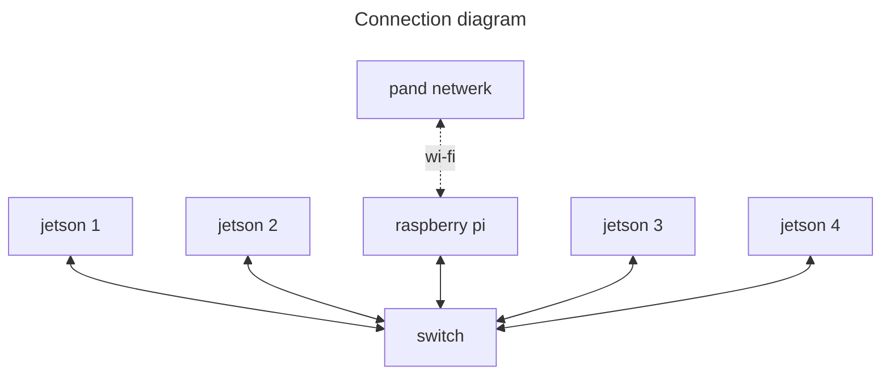

# jetson-cluster

Jetson cluster setup- en gebruiksinstructies voor het InS team

## Setup

Voor het opzetten van het cluster heb je de jetson nodes natuurlijk, een switch en een raspberry pi. Je hebt ook genoeg netwerk kabels nodig om alle jetsons en de raspberry pi met de switch te verbinden.

De setup ziet er dan als volgd uit:



De switch fungeert hier natuurlijk als switch en de raspberry pi als de router. De raspberry pi zorgt ook voor de netwerk bridge naar de pand wi-fi en voor de DHCP funtionaliteit in conbinatie met lokale DNS voor de jetsons.

Je kan ook een laptop aan de switch koppelen waarmee je dan kunt inloggen op de jetsons en de raspberry pi.

### Switch

Zorg dat de switch goed geconfigureerd is.

Hoe je dat moet doen is afhenkelijk van de switch die je gebruikt.

### Raspberry Pi

#### OS installatie

Zoals gezegd fungeerd de raspberry pi als router maar ook als wi-fi accespoint en als DHCP/DNS provider.

Begin met een schone raspbian installatie. Doe dit door het OS te downloaden van de [officiele website](https://www.raspberrypi.com/software/) en die volgens de instructies daar op een microSD kaart te zetten.

De microSD kaart in de raspberry pi, verbind een monitor toetsen board en muis aan de raspberry pi en zet hem aan. Volg de setup stappen en verbind de raspberry pi via de wifi met het netwerk.

Als de pi aan staat, open een terminal en begin met het updaten van de pi:

```shell
sudo apt update && sudo apt -y upgrade
```

#### IP configuratie

Geef de pi een vast IP adres op de ethernet poort. Doe dit door `/etc/dhcpcd.conf` aan te passen. Open de file in een editor (bijvoorbeeld met `sudo nano /etc/dhcpcd.conf`) en voeg deze regels toe aan de file:

```conf
interface eth0
static ip_address=<ip address>/24
static routers=<router address>
nogateway
```

Kies voor `<ip address>` het eerste ip adres uit de range (dus bijvoorbeeld `10.0.0.1`) en zet bij bij `<router address>` het 'nul-adres' van die range (dus bijvoorbeeld `10.0.0.0` als je `<ip address>` `10.0.0.1` is).

`nogateway` zorgt er voor dat er voor die interface geen dafault gateway wordt aangemaakt, wat ook nodig is omdat je wil dat al het verkeer wat geen lokale bestemming heeft (aka, the jetsons), het internet op gaat en niet het lokale netwerk in.

Welk IP adres je hier moet kiezen kan ook afhangen van de configuratie van de switch.

Herstart de `dhcpcd` service:

```shell
sudo service dhcpcd restart
```

#### DNS/DHCP configuratie

Installeer `dnsmasq` voor het handelen van DNCP en DNS:

```shell
sudo apt install dnsmasq
```

Maak een backup van de bestaande `dnsmasq` configuratie:

```shell
sudo cp /etc/dnsmasq.conf /etc/dnsmasq.conf.original
```

Open `/etc/dnsmasq.conf` in een editor. In de configuratie file verwijder de `#` voor de volgende regels en pas ze aan als nodig:

```conf
interface=eth0
listen-address=<ip address>
domain-needed
bogus-priv
dhcp-range=<start ip>,<eind ip>,12h
```

Met `interface` geen je aan op welk interface de pi DNS en DHCP moet aanbieden.

Met `listen-address` geef je het IP adres aan waarop de pi moet luister voor DNS en DHCP verzoeken. Dit moet het zelfde IP adres zijn als het gene dat je eerder als `static ip_address` hebt aangegeven, zonder de `/24`.

`domain-needed` en `bogus-priv` zorgen ervoor dat je geen DNS verzoeken het internet op stuurt als het duidelijk is dat ze daar niet voor bedoeld zijn.

Vul bij `dhcp-range` het IP bereik in dat de jetsons mogen gebruiken. Voorbeeld: `10.0.0.50,10.0.0.150`.

#### IP forwarding configuratie

Enable IP forwarding door `/etc/sysctl.conf` te openen in een editor. Verwijder de `#` uit `#net.ipv4.ip_forward=1`. Nu kan IP verkeer van de ethernet interface naar de wlan interface en andersom worden gestuurd.

Nu moet de firewall dat verkeer nog doorlaten. Dit doen we door `iptables` te configureren. Voer daarvoor de volgende commando's uit:

```shell
sudo iptables -A FORWARD -i eth0 -o wlan0 -j ACCEPT
sudo iptables -A FORWARD -i wlan0 -o eth0 -m state --state RELATED,ESTABLISHED -j ACCEPT
sudo iptables -t nat -A POSTROUTING -o wlan0 -j MASQUERADE
```

Wat hier precies gebeurd is als eerste dat alle verkeer van binnen komt (`-i`) op de ethernet interface (`eth0`) doorgestuurd wordt (`FORWARD`) naar (`-o`) wlan interface (`wlan`).

Daarna wordt aangegeven dat elke verbinding die gerelateerd is aan een bestaande of al opgezet is (`RELATED,ESTABLISHED`) toegestaan is (`ACCEPT`) om van de wlan interface naar de ethernet interface opgezet te worden.

De laatste regel geeft aan dat voor verkeer wat al gerouteerd is (`POSTROUTING`) naar de wlan interface het IP adres van de bron moet worden gemaskeerd (`MASQUERADE`) wat in feite de NAT functionaliteit implementeerd.

Wat nu nog moet gebeuren is de `iptables` persistent maken. Voer daarvoor dit commando uit:

```shell
sudo sh -c "iptables-save > /etc/iptables.ipv4.nat"
```

Open nu `/etc/rc.local` in een editor en voeg de volgende regel toe vóór de regel met `exit 0`:

```shell
iptables-restore < /etc/iptables.ipv4.nat
```

#### Hostname configuratie

Zodat je de raspberry pi kan terug vinden in het netwerk, geef de raspberry pi een hostname die handig is.

Open daarvoor `\etc\hostname` in een editor en pas de waarde die je daar ziet aan.

Herstart nu de raspberry pi vanaf de GUI of de terminal met:

```shell
sudo reboot
```

#### Check de setup

Plug een laptop in op de switch, zet de wifi uit op die laptop en wacht even totdat het netwerk op die laptop geconfigureerd is.

Als de setup goed is verlopen, zou de laptop het internet op moeten kunnen zonder wifi. Check ook of je via SSH bij de raspberry pi kan komen.

Open hiervoor een terminal en vooer het volgende commando uit:

```shell
ssh <gebruikersnaam>@<hostname>.local
```

De gebuikersnaam heb je aangegeven tijdens de setup van de raspberry pi, de hostname heb je als laatste stap gezet.

Als de verbinding gelegd kan worden wordt je gevraagd om een wachtwoord wat je ook tijdens de setup van de pi hebt ingevoerd.

## Gebruik

### Netwerk onderhoud

Als het wachtwoord van het wifi netwerk veranderd of als je uberhaupt een ander netwerk wilt gebruiken voor de internet verbinding van de raspberry pi kun je dat natuurlijk veranderen door een scherm, toetsenboard en muis aan de pi te koppelen en via de GUI het netwerk te veranderen, maar je kan dat ook via SSH doen.

Maak verbinding met de pi via SSH en open `/etc/wpa_supplicant/wpa_supplicant.conf`. Zet bij `ssid`, de naam van het netwerk waarje verbinding mee wilt maken en bij `psk` het wachtwoord van dat netwerk.
